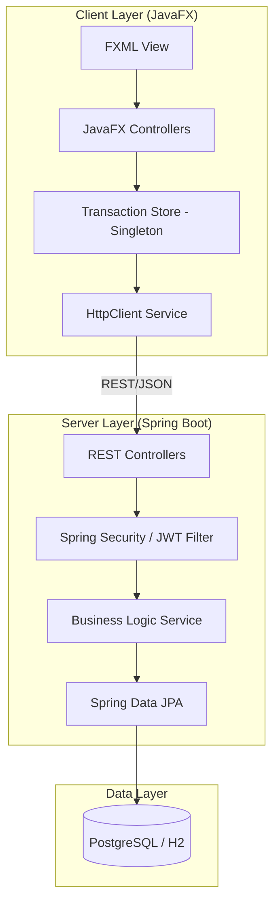
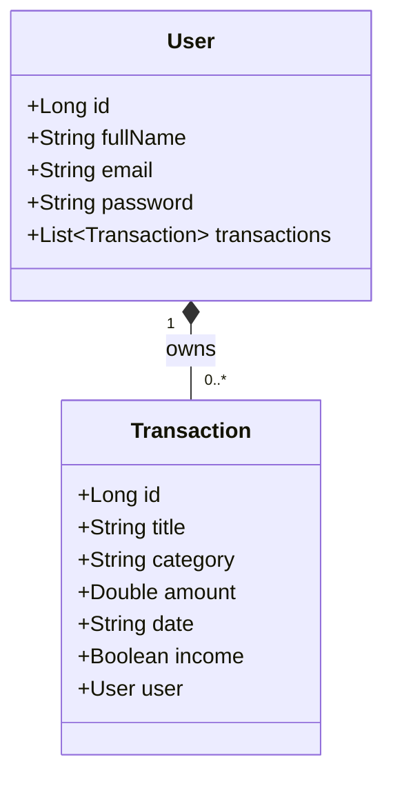
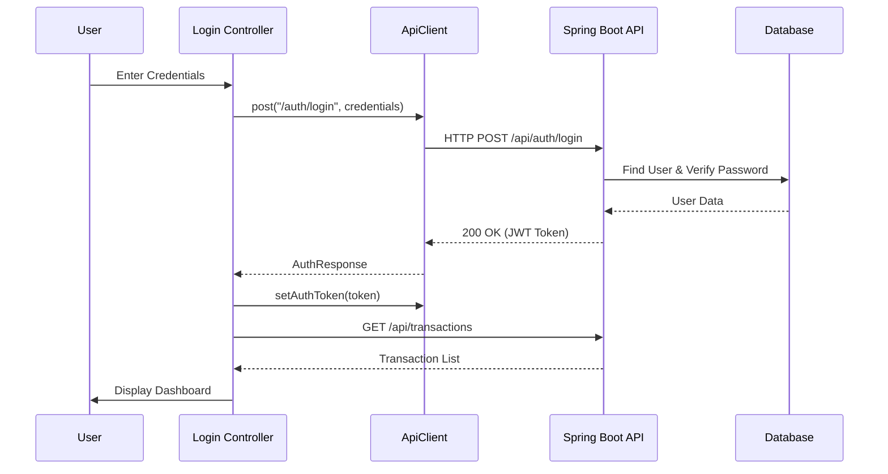
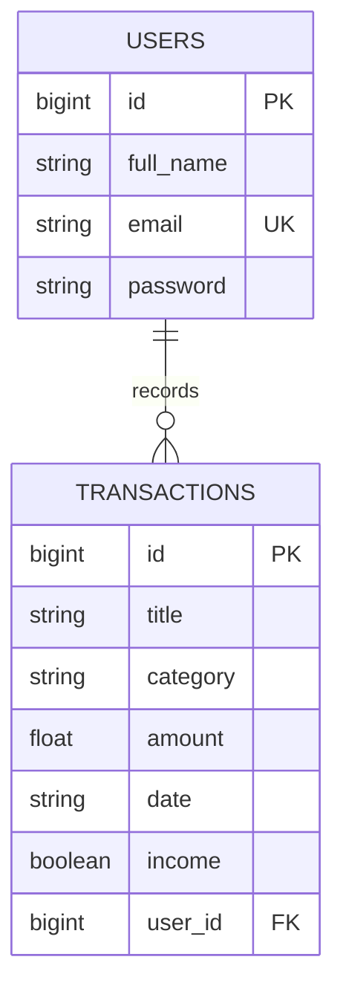

# ExpenseTracker: Enterprise System Documentation

## 1. Executive Summary
ExpenseTracker is a robust, full-stack financial management application designed to provide users with a seamless interface for tracking income, expenses, and financial analytics. Built on a modern micro-monolith architecture, it leverages a high-performance **Spring Boot 3** backend and a reactive **JavaFX 21** desktop frontend. The system emphasizes security, data integrity, and real-time visualization of financial data.

---

## 2. System Architecture
The application follows a **Client-Server Architecture** utilizing RESTful communication. 

- **Backend:** Decoupled service layer with Spring Data JPA for persistence and Spring Security (JWT) for stateless authentication.
- **Frontend:** Modular JavaFX application utilizing FXML for UI declaration and an asynchronous `HttpClient` for non-blocking API interaction.

### 2.1 High-Level Architecture Diagram (UML)

---

## 3. Technology Stack

### 3.1 Backend (Server-Side)
| Component | Technology |
| :--- | :--- |
| **Framework** | Spring Boot 3.3.5 |
| **Language** | Java 21 (LTS) |
| **Security** | Spring Security 6, JWT (io.jsonwebtoken), BCrypt |
| **Persistence** | Spring Data JPA (Hibernate) |
| **Database** | PostgreSQL (Production), H2 (Development/Testing) |
| **Build Tool** | Maven |

### 3.2 Frontend (Client-Side)
| Component | Technology |
| :--- | :--- |
| **Framework** | JavaFX 21 |
| **UI Declaration** | FXML & CSS |
| **Communication** | Java 11+ HttpClient |
| **Data Binding** | Jackson JSON Processor |
| **Build Tool** | Maven |

---

## 4. Backend System Design

### 4.1 Domain Model
The system revolves around two primary entities: `User` and `Transaction`.

### 4.2 Security Protocol (Stateless Authentication)
The system implements **JSON Web Token (JWT)** authentication.
1. **Authentication:** User provides credentials via `/api/auth/login`.
2. **Verification:** Backend validates credentials using `BCryptPasswordEncoder`.
3. **Token Issuance:** A signed JWT is returned to the client.
4. **Authorization:** Subsequent requests include the token in the `Authorization: Bearer <token>` header. The `JwtFilter` intercepts and validates the token before reaching the controllers.

### 4.3 REST API Endpoints

| Method | Endpoint | Description | Auth Required |
| :--- | :--- | :--- | :--- |
| `POST` | `/api/auth/signup` | Register a new user account | No |
| `POST` | `/api/auth/login` | Authenticate and receive JWT | No |
| `GET` | `/api/transactions` | Retrieve all transactions for the user | Yes |
| `POST` | `/api/transactions` | Create a new transaction | Yes |
| `DELETE` | `/api/transactions/{id}` | Remove a transaction | Yes |
| `GET` | `/api/transactions/summary` | Get aggregated financial metrics | Yes |

---

## 5. Frontend System Design

### 5.1 Pattern: MVC + Singleton Store
The frontend utilizes the **Model-View-Controller** pattern enhanced with a **Singleton Data Store** to manage state across different scenes.

- **View (FXML):** Defines the UI structure (Dashboard, Login, Signup).
- **Controller (Java):** Handles user interactions and updates the UI.
- **Store (`TransactionStore`):** Acts as a local cache, synchronizing with the backend to ensure high performance and offline-read capability (within the session).

### 5.2 API Communication Flow
Communication is handled by `ApiClient`, a utility class that abstracts the `java.net.http.HttpClient`. It handles:
- JSON Serialization/Deserialization (Jackson).
- Automatic injection of JWT headers.
- Unified error handling and status code mapping.

### 5.3 Sequence Diagram: User Login & Data Fetch

---

## 6. Database Design (ERD)
The database schema is optimized for relational integrity and fast retrieval of user-specific data.

---

## 7. Deployment & Operations

### 7.1 Docker Integration
The project includes a `docker-compose.yml` for rapid deployment of the PostgreSQL environment.
- **Service:** `db` (PostgreSQL 15)
- **Persistence:** Docker volumes for data durability.
- **Environment:** Managed via `.env` file.

### 7.2 Core Scripts
- `start.sh`: Orchestrates the environment setup and backend launch.
- `setup.sql`: Initial schema and seed data for the database.

---

## 8. Conclusion
ExpenseTracker is engineered for scalability and security. The separation of concerns between the Spring Boot backend and the JavaFX frontend allows for independent evolution of the client and server components, while the JWT-based security model ensures that user data remains private and protected.
